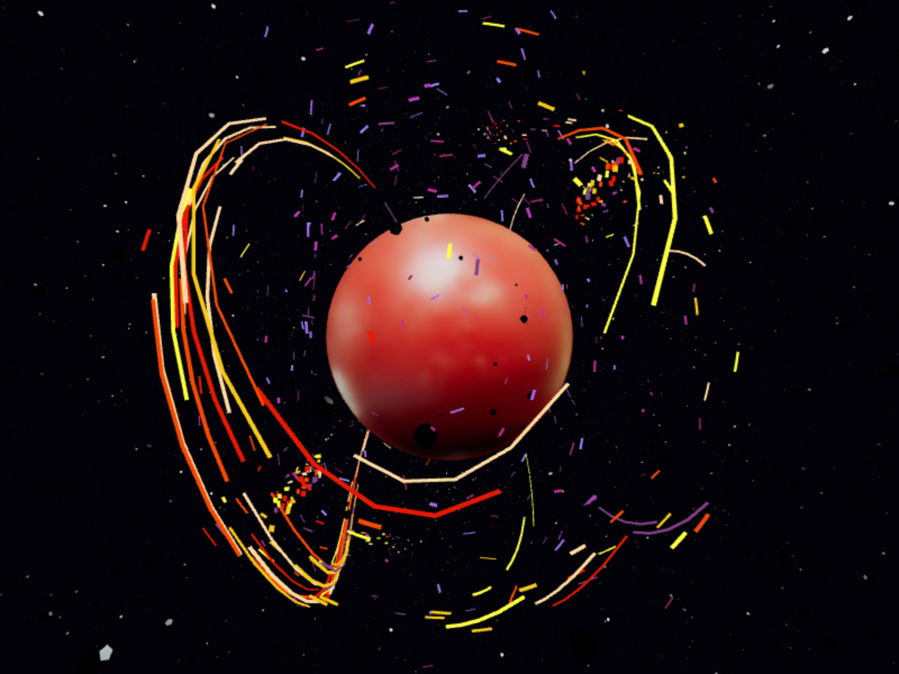

# 3d-particle-effects-demo

Code associated with the [Three ways to create 3D particle effects
](https://varun.ca/three-js-particles) post.

It demonstrates three techniques for creating particle systems

1. **Space Dust:** Using instanced meshes and oscillating their transforms.
2. **Sparks:** Using dashed lines with an animated offset.
3. **Spark storm:** By drawing a short line and advancing it step by step.

## Tech Stack

- **React 18.3** - UI library with concurrent rendering support
- **React Three Fiber 8.17** - React renderer for Three.js
- **Three.js 0.182** - 3D graphics library
- **canvas-sketch-util** - Random number generation and utilities

## Available Scripts

### Development

#### `npm start`

Runs the app in development mode.
Open [http://localhost:3000](http://localhost:3000) to view it in the browser.

The page will reload if you make edits.
You will also see any lint errors in the console.

#### `npm test`

Launches the test runner in interactive watch mode.
The project includes comprehensive component tests for:
- React 18 concurrent rendering compatibility
- React Three Fiber integration
- Component purity and deterministic behavior
- Three.js rendering

Run `npm test -- --watchAll=false` for a single test run.

### Code Quality

#### `npm run lint`

Runs ESLint to check for code quality issues.
Reports errors and warnings based on the project's ESLint configuration.

#### `npm run lint:fix`

Automatically fixes ESLint issues where possible.
Use this to quickly resolve auto-fixable linting problems.

#### `npm run format`

Formats all source files using Prettier.
Ensures consistent code style across the project.

#### `npm run format:check`

Checks if files are formatted correctly without modifying them.
Useful for CI/CD pipelines to enforce code style.

### Production

#### `npm run build`

Builds the app for production to the `build` folder.
It correctly bundles React in production mode and optimizes the build for the best performance.

The build is minified and the filenames include the hashes.
Your app is ready to be deployed!

See the section about [deployment](https://facebook.github.io/create-react-app/docs/deployment) for more information.

## Development Workflow

1. **Before making changes:** Run `npm run format` to ensure consistent code style
2. **During development:** Use `npm start` to run the dev server with hot reload
3. **Write tests:** Add tests for new components in `*.test.js` files
4. **Check code quality:** Run `npm run lint` to catch issues early
5. **Run tests:** Use `npm test` to verify everything works
6. **Before committing:** Run `npm run lint:fix` and `npm run format`

## Testing

The project uses the following testing infrastructure:

- **@testing-library/react** - React component testing utilities
- **@testing-library/jest-dom** - Custom Jest matchers for DOM assertions
- **@testing-library/user-event** - User interaction simulation

All components have comprehensive test coverage including:
- Basic rendering tests
- React 18 concurrent mode compatibility
- Props validation and edge cases
- Integration with React Three Fiber

## Code Quality Standards

- **ESLint:** Enforces code quality and React best practices
- **Prettier:** Ensures consistent code formatting
- **PropTypes:** Runtime type checking for component props
- **React Hooks Rules:** Ensures components follow React purity requirements

## TypeScript Support

The project includes TypeScript type definitions for:
- React and React DOM
- Three.js
- Node.js

While components are currently in JavaScript, the infrastructure is ready for gradual TypeScript migration.

## Contributing

1. Fork the repository
2. Create a feature branch (`git checkout -b feature/amazing-feature`)
3. Make your changes following the code quality standards
4. Run `npm run lint:fix` and `npm run format`
5. Run `npm test` to ensure all tests pass
6. Commit your changes (`git commit -m 'Add amazing feature'`)
7. Push to the branch (`git push origin feature/amazing-feature`)
8. Open a Pull Request
